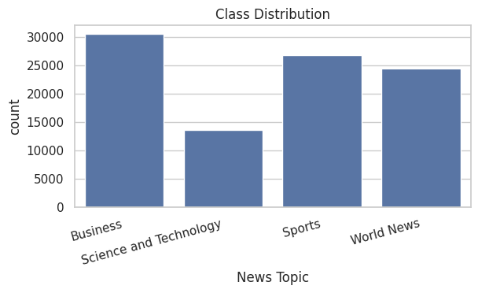
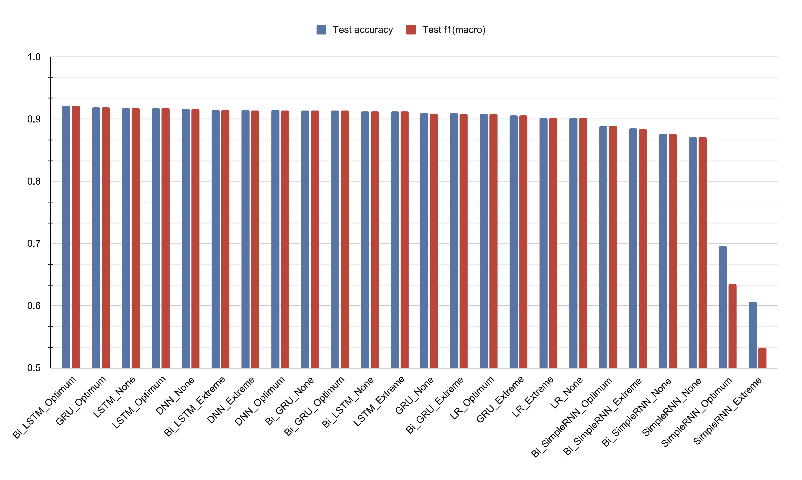
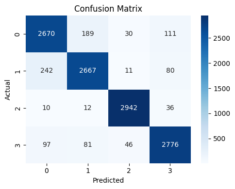
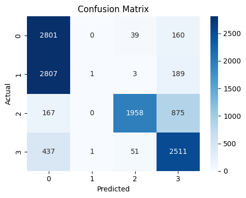

# Multi-Class Text Classification: A Comparative Analysis

A comparative study of multi-class news headline classification into four categories — **Business**, **Science and Technology**, **Sports**, and **World News** — using three preprocessing strategies, two word representation techniques (TF-IDF and Skip-gram), and eight model architectures.

## Table of Contents

- [Overview](#overview)
- [Dataset](#dataset)
- [Repository Structure](#repository-structure)
- [Methodology](#methodology)
  - [Preprocessing](#preprocessing)
  - [Word Representation](#word-representation)
- [Models](#models)
- [Experimental Setup](#experimental-setup)
- [Results](#results)
  - [Best vs. Worst Model Analysis](#best-vs-worst-model-analysis)
- [Key Findings](#key-findings)
- [References](#references)
- [Authors](#authors)

## Overview

This project explores how preprocessing and representation choices affect performance on short, noisy news text. News headlines are information-dense and often contain HTML fragments, abbreviations, and topic-specific vocabulary. To study this trade-off, three preprocessing branches were designed — **No Preprocessing**, **Extreme Preprocessing**, and **Optimum Preprocessing** — and evaluated across TF-IDF-based models and Skip-gram-based recurrent neural network models.

## Dataset

The training dataset contains 95,440 news headlines across two columns: `News Headline` and `News Topic`. It contains no missing values but includes HTML-style markup and formatting artifacts that required cleaning.

| Statistic | Value |
|---|---|
| Number of samples | 95,440 |
| Number of columns | 2 |
| Missing values | 0 |
| Business | 30,563 (32.02%) |
| Sports | 26,773 (28.05%) |
| World News | 24,415 (25.58%) |
| Science and Technology | 13,689 (14.34%) |

The class distribution is moderately imbalanced, which is why macro F1-score was used alongside accuracy throughout the project.




**Average headline length per class (raw text):**

| Class | Avg Words | Avg Chars |
|---|---|---|
| Business | 46.51 | 299.15 |
| Science and Technology | 46.17 | 294.78 |
| Sports | 46.76 | 282.56 |
| World News | 47.86 | 300.45 |

Headline length is fairly uniform across classes, meaning classification must rely on vocabulary and semantics rather than length.

## Repository Structure

```
.
├── EDA.ipynb
├── No Preprocessing.ipynb
├── Optimum Preprocessing.ipynb
├── Extreme Preprocessing.ipynb
├── Tuning Experiment/
│   ├── No_Preprocessing_ALL_Tuning.ipynb
│   ├── no_tuning_results.csv
│   ├── Optimum_Preprocessing_ALL_Tuning.ipynb
│   ├── optimum_tuning_results.csv
│   ├── Extreme_Preprocessing_ALL_Tuning.ipynb
│   ├── extreme_tuning_results.csv
│   └── logistic_regression_tuning_results.csv
├── figures/
│   ├── class_distribution.png
│   ├── wordcloud.png
│   ├── model_comparison.png
│   ├── cm_bi_lstm_optimum.png
│   └── cm_simple_rnn_extreme.png
└── README.md
```

| File | Description |
|---|---|
| `EDA.ipynb` | Exploratory data analysis: class distribution, headline length, vocabulary, word clouds |
| `No Preprocessing.ipynb` | Model training on raw, uncleaned text |
| `Optimum Preprocessing.ipynb` | Model training on the balanced preprocessing branch (lemmatization, stopwords kept) |
| `Extreme Preprocessing.ipynb` | Model training on the aggressively cleaned branch (stemming, stopword removal, short-word filtering) |
| `Tuning Experiment/` | Hyperparameter tuning notebooks and result CSVs for each preprocessing branch and for Logistic Regression |

## Methodology

### Preprocessing

All branches share a common first step: lowercasing, HTML tag removal, removal of the boilerplate phrase `news headlines:`, punctuation/non-alphabetic character removal, and whitespace normalization. From there, three branches diverge:

- **No Preprocessing** — text kept in raw form after common cleaning; serves as a baseline. Vocabulary: 152,016 tokens, average 46.88 tokens/headline.
- **Extreme Preprocessing** — stopword removal, short-word removal, and stemming. Vocabulary: 56,528 tokens, average 24.13 tokens/headline. Aggressive reduction risks discarding discriminative terms, especially named entities.
- **Optimum Preprocessing** — stopwords retained, lemmatization used instead of stemming to avoid distorting named entities (e.g., "Reuters" becoming "reuter"). Vocabulary: 68,597 tokens, average 36.71 tokens/headline.

### Word Representation

- **TF-IDF** — generated with `TfidfVectorizer` (default settings), used as input for Logistic Regression and the DNN.
- **Skip-gram** — Word2Vec embeddings trained from scratch (vector dimension 100, context window 5, minimum word frequency 1, 10 epochs). Headlines were converted to sequences of 100-dimensional vectors, out-of-vocabulary words treated as zero vectors, and sequences post-padded to a maximum length of 50 tokens for the recurrent models.

## Models

Eight models were implemented and compared:

1. Logistic Regression (LR)
2. Deep Neural Network (DNN)
3. SimpleRNN
4. GRU
5. LSTM
6. Bidirectional SimpleRNN
7. Bidirectional GRU
8. Bidirectional LSTM

**DNN architecture:** Dense(128, ReLU) → Dropout(0.4) → Dense(64, ReLU) → Dense(32, ReLU) → Dense(4, Softmax)

## Experimental Setup

Three preprocessing branches were combined with the model set. Five hyperparameter configurations were tested for Logistic Regression and eight for each neural model, giving 183 total experiments:

```
(3 x 1 x 5) + (3 x 7 x 8) = 183
```

All neural models used the Adam optimizer, categorical cross-entropy loss, and early stopping (patience = 2). Model selection prioritized validation macro F1-score, with validation accuracy as a secondary reference and training metrics monitored to catch over/underfitting.

## Results

Final evaluation was run on a balanced test set (3,000 samples per class), so accuracy and macro F1-score track closely for every model.

| Preprocessing | Model | Accuracy | Macro F1 |
|---|---|---|---|
| None | LR | 0.9022 | 0.9016 |
| None | DNN | 0.9163 | 0.9160 |
| None | SimpleRNN | 0.8714 | 0.8708 |
| None | LSTM | 0.9175 | 0.9172 |
| None | GRU | 0.9094 | 0.9091 |
| None | Bi-SimpleRNN | 0.8765 | 0.8760 |
| None | Bi-LSTM | 0.9132 | 0.9127 |
| None | Bi-GRU | 0.9142 | 0.9139 |
| Optimum | LR | 0.9093 | 0.9090 |
| Optimum | DNN | 0.9145 | 0.9143 |
| Optimum | SimpleRNN | 0.6958 | 0.6349 |
| Optimum | LSTM | 0.9174 | 0.9172 |
| Optimum | GRU | 0.9188 | 0.9186 |
| Optimum | Bi-SimpleRNN | 0.8888 | 0.8887 |
| **Optimum** | **Bi-LSTM** | **0.9213** | **0.9212** |
| Optimum | Bi-GRU | 0.9136 | 0.9134 |
| Extreme | LR | 0.9024 | 0.9022 |
| Extreme | DNN | 0.9147 | 0.9144 |
| Extreme | SimpleRNN | 0.6059 | 0.5324 |
| Extreme | LSTM | 0.9128 | 0.9124 |
| Extreme | GRU | 0.9063 | 0.9061 |
| Extreme | Bi-SimpleRNN | 0.8851 | 0.8845 |
| Extreme | Bi-LSTM | 0.9157 | 0.9154 |
| Extreme | Bi-GRU | 0.9093 | 0.9093 |



The **No Preprocessing** branch achieved the best overall performance on average, followed by **Optimum Preprocessing**, while **Extreme Preprocessing** performed the worst — indicating that headlines already carry strong lexical cues, and over-cleaning can strip out useful named entities and domain-specific terms. The gated recurrent architectures (GRU, LSTM, and their bidirectional variants) clustered tightly between roughly 91.7% and 92.1% accuracy, while SimpleRNN was far more volatile, ranging from 87.14% down to 60.59% depending on preprocessing, due to its limited memory and vulnerability to vanishing gradients.

### Best vs. Worst Model Analysis

**Best model: Bidirectional LSTM with Optimum Preprocessing** — 92.13% test accuracy, 92.12% macro F1. It classified all four classes with high confidence, with most confusion occurring between Business and World News, which often share vocabulary around politics and economics.



**Worst model: SimpleRNN with Extreme Preprocessing** — 60.59% test accuracy, 0.532 macro F1. The confusion matrix shows a severe class collapse between Business and World News, and heavy misclassification of Science and Technology into World News. This resulted from the combination of SimpleRNN's vanishing-gradient limitation and the loss of discriminative vocabulary from extreme preprocessing.



## Key Findings

- Moderate dropout (0.3–0.5) produced the most stable validation performance across neural models.
- Very small model capacity or overly strong regularization (e.g., Logistic Regression with C = 0.01) led to underfitting.
- High-capacity recurrent models, particularly Bidirectional LSTM at large capacity, showed mild overfitting (high training accuracy with little validation gain).
- Bidirectional variants generally outperformed their unidirectional counterparts.
- Optimum preprocessing consistently produced more balanced results than extreme preprocessing.
- Validation macro F1-score was the most informative tuning metric given the class imbalance.
- TF-IDF with Logistic Regression remained a strong, efficient baseline, while Skip-gram-based gated recurrent models (GRU, LSTM, Bi-LSTM) captured contextual dependencies more effectively.

## References

1. S. Hochreiter, "The vanishing gradient problem during learning recurrent neural nets and problem solutions," *International Journal of Uncertainty, Fuzziness and Knowledge-Based Systems*, vol. 6, no. 2, pp. 107–116, 1998.
2. T. Mikolov, K. Chen, G. Corrado, and J. Dean, "Efficient estimation of word representations in vector space," arXiv preprint arXiv:1301.3781, 2013.
3. M. Schuster and K. K. Paliwal, "Bidirectional recurrent neural networks," *IEEE Transactions on Signal Processing*, vol. 45, no. 11, pp. 2673–2681, 1997.
4. S. Hochreiter and J. Schmidhuber, "Long short-term memory," *Neural Computation*, vol. 9, no. 8, pp. 1735–1780, 1997.
5. J. Chung, C. Gulcehre, K. Cho, and Y. Bengio, "Empirical evaluation of gated recurrent neural networks on sequence modeling," arXiv preprint arXiv:1412.3555, 2014.

## Authors

- **Moshee-Ur Rahman** — Department of Computer Science and Engineering, BRAC University — moshee.ur.rahman@g.bracu.ac.bd
- **Nafis Uddin Chowdhury** — Department of Computer Science and Engineering, BRAC University — nafis.uddin.chowdhury@g.bracu.ac.bd
